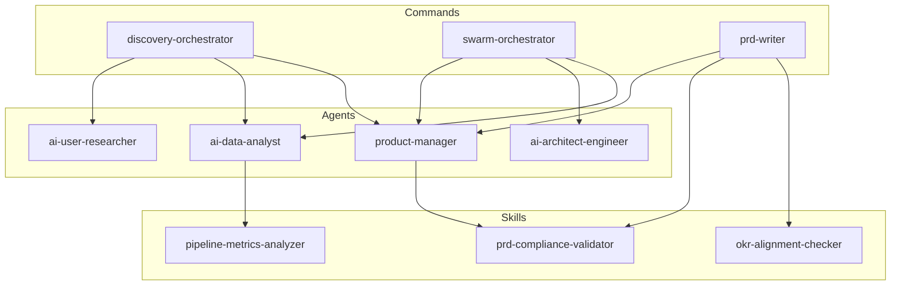

# NexusFlow Component Index

This document provides a comprehensive index of all AI components available in this repository.

## Summary

| Category | Count | Location |
|----------|-------|----------|
| Agents | 13 | `.claude/agents/` |
| Commands | 4 | `.claude/commands/` |
| Skills | 8 | `.claude/skills/` |
| **Total** | **25** | - |

---

## Agents

### Product & Strategy

| ID | Name | Description | File |
|----|------|-------------|------|
| `ai-pm` | AI Product Manager | General product management tasks | `agents/ai-pm.md` |
| `product-manager` | Product Manager | PRD writing and feature specs | `agents/product-manager.md` |
| `ai-product-marketing` | Product Marketing | Positioning and messaging | `agents/ai-product-marketing.md` |

### Research & Analysis

| ID | Name | Description | File |
|----|------|-------------|------|
| `ai-user-researcher` | User Researcher | User research and interviews | `agents/ai-user-researcher.md` |
| `ai-data-analyst` | Data Analyst | Data analysis and insights | `agents/ai-data-analyst.md` |
| `product-usage-analyst` | Usage Analyst | Product usage patterns | `agents/product-usage-analyst.md` |
| `competitive-benchmarking` | Competitive Analysis | Competitor benchmarking | `agents/competitive-benchmarking.md` |

### Engineering

| ID | Name | Description | File |
|----|------|-------------|------|
| `ai-architect-engineer` | Architect | System architecture | `agents/ai-architect-engineer.md` |
| `ai-frontend-engineer` | Frontend Engineer | UI/UX implementation | `agents/ai-frontend-engineer.md` |
| `ai-data-ml-engineer` | ML Engineer | AI/ML features | `agents/ai-data-ml-engineer.md` |
| `nexusflow-architecture-guardian` | Architecture Guardian | Code standards | `agents/nexusflow-architecture-guardian.md` |
| `qa-expert` | QA Expert | Testing and quality | `agents/qa-expert.md` |

### Design

| ID | Name | Description | File |
|----|------|-------------|------|
| `ai-product-designer` | Product Designer | Visual and interaction design | `agents/ai-product-designer.md` |

---

## Commands

| Command | Description | File |
|---------|-------------|------|
| `/discovery-orchestrator` | Run full discovery process | `commands/discovery-orchestrator.md` |
| `/swarm-orchestrator` | Multi-agent coordination | `commands/swarm-orchestrator.md` |
| `/prd-writer` | AI-assisted PRD writing | `commands/prd-writer.md` |
| `/custom-slash-command-writer` | Create new commands | `commands/custom-slash-command-writer.md` |

---

## Skills

### Analysis Skills

| ID | Name | Description | File |
|----|------|-------------|------|
| `pipeline-metrics-analyzer` | Pipeline Analyzer | Sales pipeline metrics | `skills/pipeline-metrics-analyzer/SKILL.md` |
| `business-case-calculator` | Business Case | ROI calculations | `skills/business-case-calculator/SKILL.md` |

### Validation Skills

| ID | Name | Description | File |
|----|------|-------------|------|
| `prd-compliance-validator` | PRD Validator | PRD completeness check | `skills/prd-compliance-validator/SKILL.md` |
| `okr-alignment-checker` | OKR Checker | OKR alignment validation | `skills/okr-alignment-checker/SKILL.md` |

### Content Skills

| ID | Name | Description | File |
|----|------|-------------|------|
| `humanizer-skill` | Humanizer | Content readability | `skills/humanizer-skill/SKILL.md` |

### Design Skills

| ID | Name | Description | File |
|----|------|-------------|------|
| `nexusflow-frontend-design` | Frontend Design | NexusFlow design system | `skills/nexusflow-frontend-design/SKILL.md` |
| `nexusflow-brand-guidelines` | Brand Guidelines | Brand standards | `skills/nexusflow-brand-guidelines/SKILL.md` |

### Strategy Skills

| ID | Name | Description | File |
|----|------|-------------|------|
| `product-strategy-stack` | Strategy Stack | Strategic analysis | `skills/product-strategy-stack/SKILL.md` |

---

## Component Dependencies



---

## Usage Patterns

### Discovery Flow
```
/discovery-orchestrator
  → ai-user-researcher (interviews)
  → ai-data-analyst (metrics)
  → product-manager (synthesis)
  → prd-compliance-validator (validation)
```

### PRD Creation Flow
```
/prd-writer
  → product-manager (drafting)
  → ai-architect-engineer (technical review)
  → prd-compliance-validator (validation)
  → okr-alignment-checker (alignment)
```

### Analysis Flow
```
ai-data-analyst
  → pipeline-metrics-analyzer (sales data)
  → business-case-calculator (impact)
  → product-manager (recommendations)
```

---

## Version History

| Version | Date | Changes |
|---------|------|---------|
| 2.4.0 | Jan 2026 | Added nexusflow-architecture-guardian |
| 2.3.0 | Dec 2025 | Added product-strategy-stack skill |
| 2.2.0 | Nov 2025 | Added swarm-orchestrator command |
| 2.1.0 | Oct 2025 | Initial component index |

---

## Maintenance

- **Owner**: Product Platform Team
- **Review Cycle**: Monthly
- **Last Review**: January 2026
- **Next Review**: February 2026
